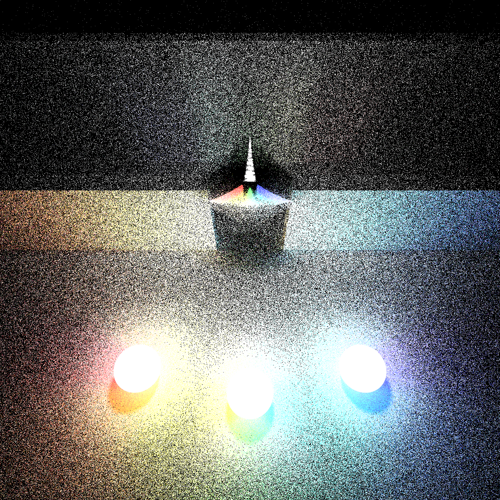
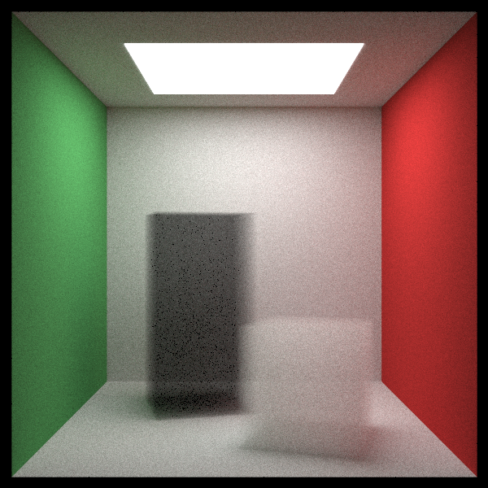
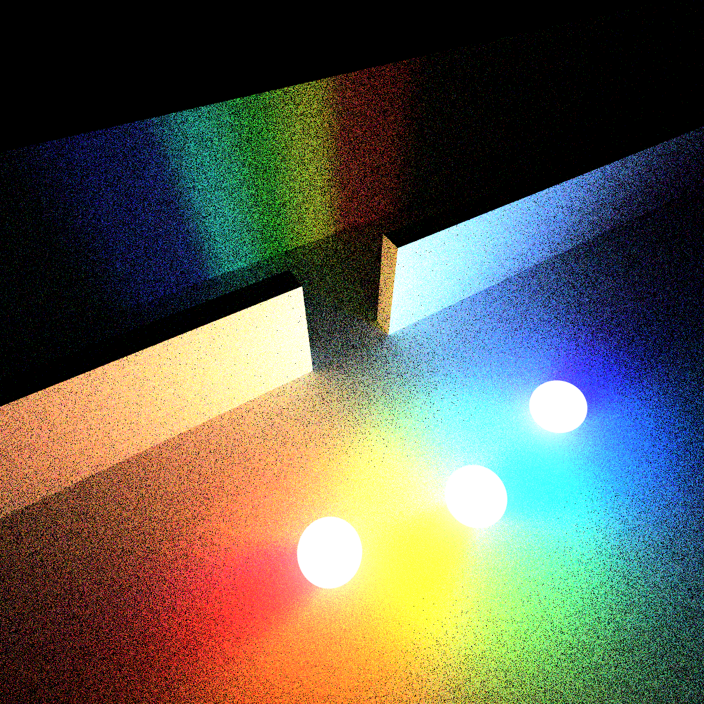
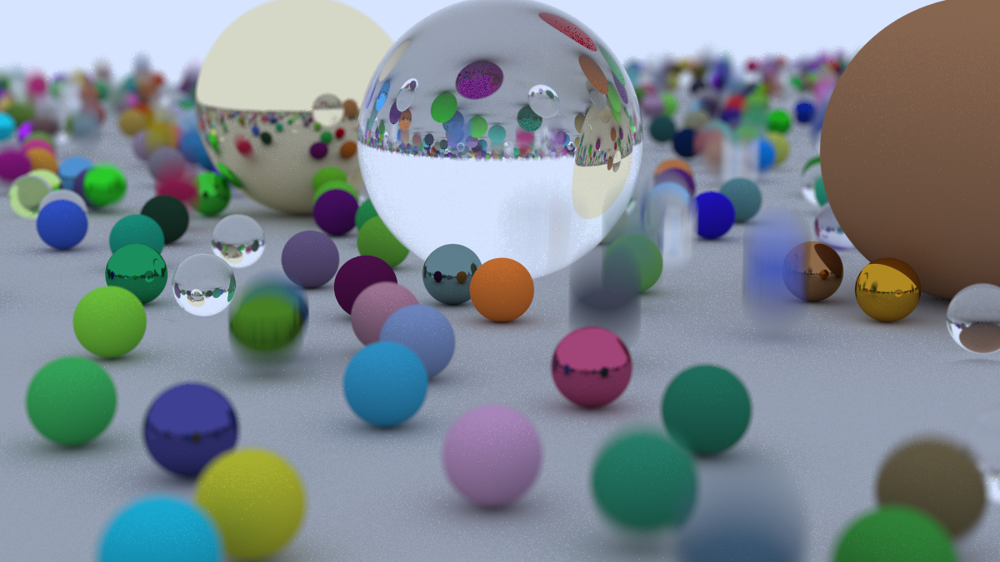

# Ray Tracing with Motion Blur

A physically based ray tracer written in **Rust**, featuring **motion blur**, **adaptive sampling**, and both **single-threaded** and **multi-threaded** rendering using Rayon. Examples of scene are shown below.

<p align="center">
  
  
</p>
<p align="center">
  
  
</p>
<p align="center">
  
</p>


## Prerequisites

To build and run this project, ensure the following tools are installed:

* **Rust Toolchain**
  Required to compile and run the renderer (Rust + Cargo).


## Running the Project

```bash
./run.sh
```

This script builds the project and starts the renderer with the default configuration.


## References

* Marschner, S., & Shirley, P. (2015). *Fundamentals of Computer Graphics* (4th ed.). A K Peters / CRC Press.
* Shirley, P., Black, T. D., & Hollasch, S. (2025). *Ray Tracing in One Weekend*.
  [https://raytracing.github.io/books/RayTracingInOneWeekend.html](https://raytracing.github.io/books/RayTracingInOneWeekend.html)
* Shirley, P., Black, T. D., & Hollasch, S. (2025). *Ray Tracing: The Next Week*.
  [https://raytracing.github.io/books/RayTracingTheNextWeek.html](https://raytracing.github.io/books/RayTracingTheNextWeek.html)


## Authors

This project was developed as part of **2110479 Computer Graphics (2025/1)**.

* Haminic
* Duckin
* RimuWachi
